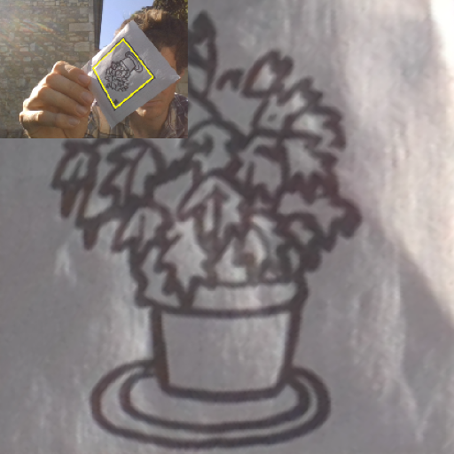

# Cardscan

OpenCV python pipeline to extract black bordered frame in an image. Post process the image, find and filter contours, fix the perspective, crop and rotate. No machine learning involved.

> Experimental stage project



## Install

``` python
pip install cardscan
```

## Usage


``` python
import cv2
from cardscan import scan

img = cv2.imread('path_to_your_image.jpg') 
img_result_array = scan(img)
```

More examples [here](examples/)


## Dev

install poetry

``` sh
pip install poetry

```

install dependencies

``` sh

# cd at the project root
poetry install
```

run one of the pipeline visualization app

``` sh
poetry run python -m examples.cam_draw_pip
poetry run python -m examples.cam_use_pipeline
poetry run python -m examples.cam_visual_pipeline
poetry run python -m examples.cam_visual_contours
poetry run python -m examples.cam_simple
poetry run python -m examples.from_file
```

